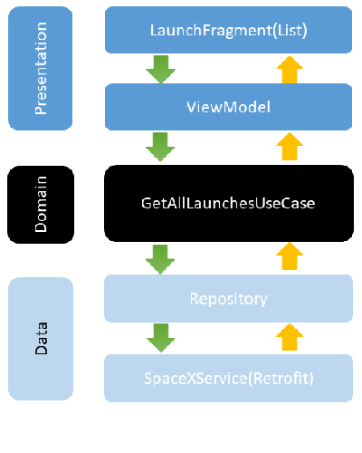

# SpaceX App Android
With this application users can see all the launches from SpaceX API.

## User experience

This project contains the following features

* A list of launches from SpaceX API with aditional information
    - Mission Name
    - Rocket Name
    - Launch Site Name
    - Date of Launch
    - Launch patch image, or default image when not provided by the API
* Each summary item is clickable. When clicked the full mission details provided by the API is be displayed

## Animation

  

## Screenshots

* Normal phone

  
  

* Tablet

  

## Overview

### SpaceX Launches API v3

This project implements the SpaceX API. For more information visit https://docs.spacexdata.com/

### Architecture
Using MVVM as the architectural pattern.

### Flow

  

### Network calls - Retrofit

This project use Retrofit in order to get a list of all launches and perform an API call.

### Images - Glide

This project use Glide to load launches images from the url obtained from the server.

### Dependency injection - Hilt

This project use Hilt in order to perform dependency injection

## Copyright

The open source API of SpaceX used in this project is provided by the following site: https://www.spacex.com/
