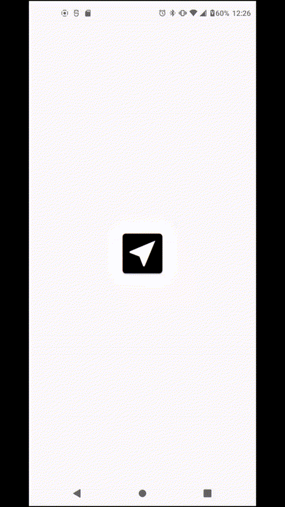
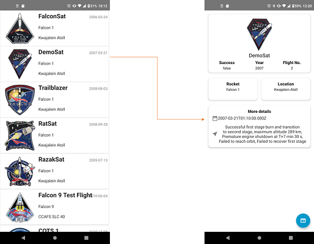
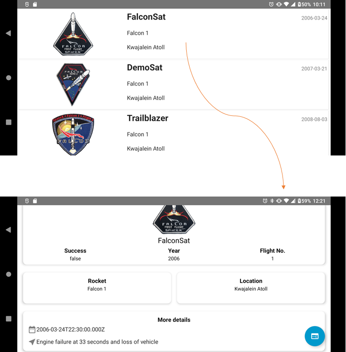
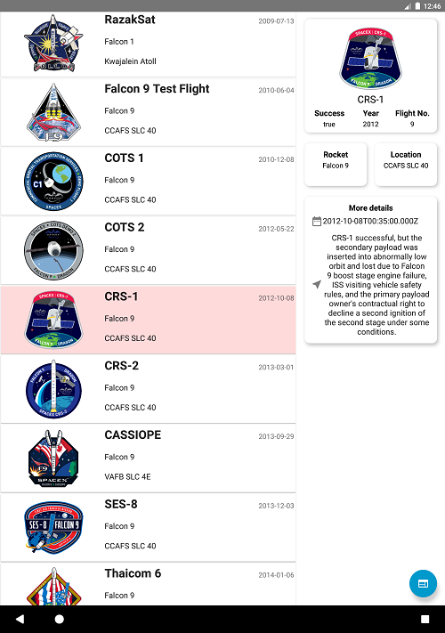

# SpaceX App Android
With this application users can see all the launches from SpaceX API.

## User experience

This project contains the following features

* A list of launches from SpaceX API with aditional information
    - Mission Name
    - Rocket Name
    - Launch Site Name
    - Date of Launch
    - Launch patch image, or default image when not provided by the API
* Each summary item is clickable. When clicked the full mission details provided by the API is be displayed

## Animation

  

## Screenshots

* Normal phone

  
  

* Tablet

  

## Copyright

The open source API of SpaceX used in this project is provided by the following site: https://rickandmortyapi.com/